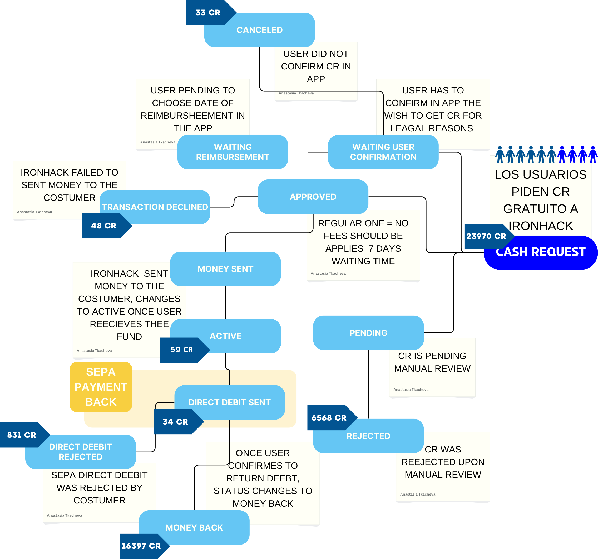
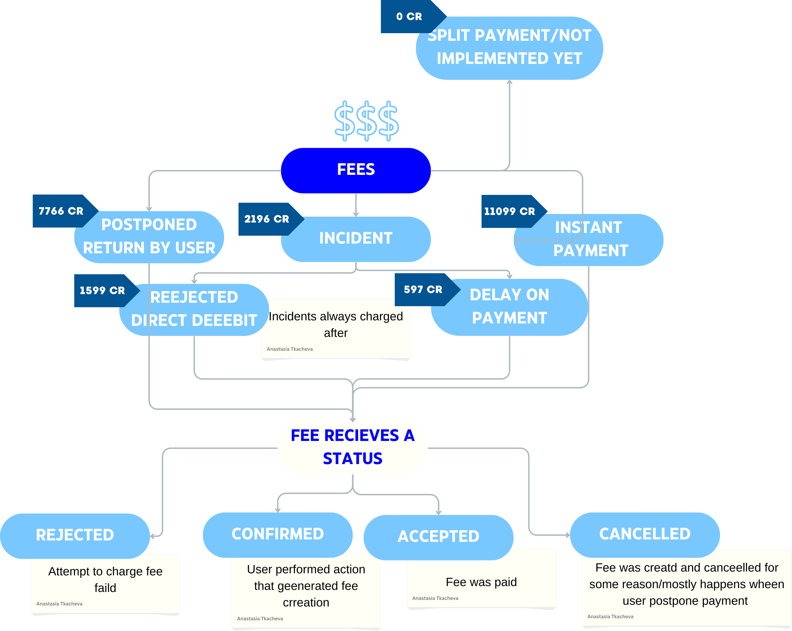
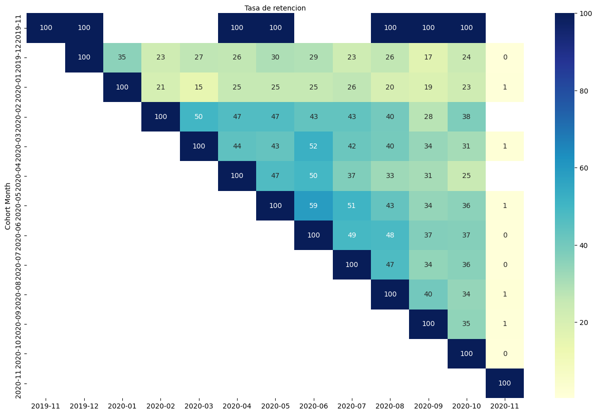
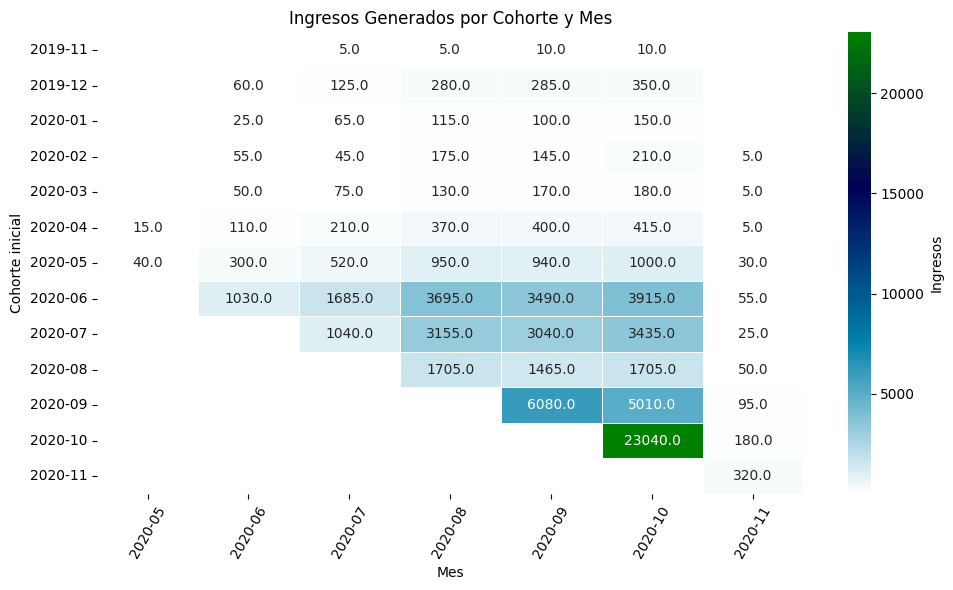
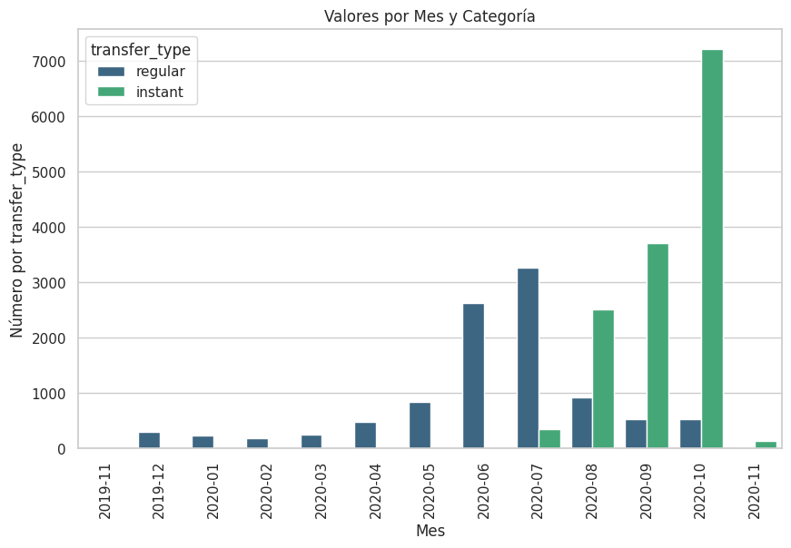
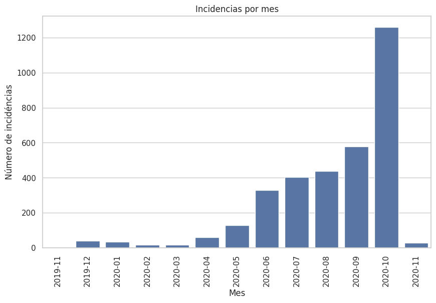
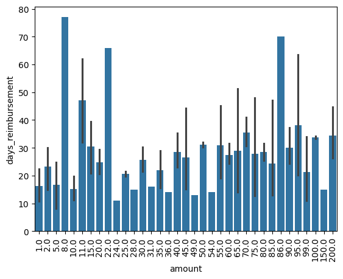

# Desafío Empresarial: Análisis de Cohortes para los Pagos de Ironhack (Proyecto 1)

## Introducción

IronHack Payments, una empresa de servicios financieros de vanguardia, ha estado ofreciendo soluciones innovadoras de adelanto de efectivo desde su creación en 2020. Con un compromiso de proporcionar adelantos de dinero gratuitos y precios transparentes, IronHack Payments ha logrado una base de usuarios sustancial. Como parte de su esfuerzo continuo por mejorar sus servicios y entender el comportamiento de los usuarios, IronHack Payments ha encargado un proyecto de análisis de cohortes.

## Visión General del Proyecto

En este proyecto, realizarás un análisis de cohortes exhaustivo basado en datos proporcionados por IronHack Payments. El objetivo principal es analizar cohortes de usuarios definidos por el mes de creación de su primer adelanto en efectivo. Seguirás la evolución mensual de las métricas clave para estas cohortes, lo que permitirá a IronHack Payments obtener valiosas perspectivas sobre el comportamiento de los usuarios y el rendimiento de sus servicios financieros.

### Métricas a Analizar

Calcularás y analizarás las siguientes métricas para cada cohorte:

1. **Frecuencia de Uso del Servicio:** Comprender con qué frecuencia los usuarios de cada cohorte utilizan los servicios de adelanto de efectivo de IronHack Payments a lo largo del tiempo.
2. **Tasa de Incidentes:** Determinar la tasa de incidentes, enfocándose específicamente en los incidentes de pago, para cada cohorte. Identificar si hay variaciones en las tasas de incidentes entre diferentes cohortes.
3. **Ingresos Generados por la Cohorte:** Calcular el total de ingresos generados por cada cohorte a lo largo de los meses para evaluar el impacto financiero del comportamiento de los usuarios.
4. **Nueva Métrica Relevante:** Proponer y calcular una nueva métrica relevante que brinde perspectivas adicionales sobre el comportamiento de los usuarios o el rendimiento de los servicios de IronHack Payments.

### Herramientas de Análisis de Datos

Se espera que realices el análisis de cohortes utilizando Python, aprovechando principalmente la biblioteca Pandas para la manipulación y análisis de datos. Sin embargo, el análisis principal debe realizarse utilizando Python.

### Análisis Exploratorio de Datos (EDA)

Antes de sumergirte en el análisis de cohortes, realiza un análisis exploratorio de datos para obtener una comprensión completa del conjunto de datos. Explora estadísticas clave, distribuciones y visualizaciones para identificar patrones y valores atípicos. El EDA te ayudará a tomar decisiones informadas sobre estrategias de preprocesamiento y análisis de datos.

### Análisis de la Calidad de Datos

Evalúa la calidad del conjunto de datos identificando valores faltantes, inconsistencias en los datos y posibles errores. Implementa pasos de limpieza y preprocesamiento de datos para garantizar la fiabilidad de tu análisis. Documenta cualquier problema de calidad de datos encontrado y los pasos tomados para abordarlos.

### Entregables

1. **Código en Python:** Proporciona código en Python bien documentado que realice el análisis de cohortes, incluyendo la carga de datos, preprocesamiento, creación de cohortes, cálculo de métricas y visualización.
2. **Informe de Análisis Exploratorio de Datos:** Prepara un informe que resuma los hallazgos de tu análisis exploratorio de datos. Incluye visualizaciones e insights que ayuden a entender el conjunto de datos.
3. **Informe de Análisis de la Calidad de Datos:** Documenta los resultados de tu análisis de calidad de datos, destacando cualquier problema y los pasos tomados para resolverlos.
4. **Presentación Corta:** Crea una presentación concisa (máximo de 4 diapositivas) que resuma tus hallazgos del análisis de cohortes y las perspectivas clave obtenidas del EDA y el análisis de calidad de datos. Esta presentación debe ser adecuada para compartir con el equipo de IronHack Payments.

# Solución del proyecto

## Estructura del proyecto

```bash
.
├── Entorno Personal
│   ├── Alejandro
│   ├── Anastasia
│   │   └── Resources
│   ├── Marc
│   └── Toni
├── img
├── Informe Análisis de Cohortes.pdf
├── Informe Análisis Exploratorio.pdf
├── Notebooks
│   ├── 01-EDA.ipynb
│   ├── 02-Retencion.ipynb
│   ├── 03-Tasa-de-Incidencia.ipynb
│   ├── 04-Ingresos-por-cohorte.ipynb
│   ├── 05-Analisis amount vs return_days_diff.ipynb
│   ├── 06-Weekday vs hour.ipynb
│   └── merged_df.csv
├── project_dataset
│   ├── ~$Lexique - Data Analyst.xlsx
│   ├── cash_request.csv
│   ├── fees_data.csv
│   └── Lexique - Data Analyst.xlsx
├── readme.md
└── req.txt


```

## Devtools

Herramientas necesarias para la ejecución del código:

```
Python 3.10.12
Jupyter notebook
```

Módulos python necesarios:

```
matplotlib==3.8.4
numpy==1.26.4
pandas==2.2.2
plotly==5.22.0
seaborn==0.13.2
```

## Análisis realizados


### Análisis del flujo de datos

Basado en los datos analizados hemos detectado los siguientes data flows:

#### Cash



#### Fees


### Retención por cohorte de fechas

Hemos analizado la tasa de retención por fecha de creación y vemos que a medida que más usuarios usan el servicio la tasa de retención aumenta, especialmente cuando aparece el módo instantáneo.




### Ingresos de fees por cohorte:

Hemos identificado que los ingresos por comisiones se generan a partir de mayo de 2020. Esto sugiere una posible actualización en la plataforma, introduciendo comisiones en ciertas acciones.

Con esta información en mente, hemos enfocado nuestro análisis en las transacciones con estatus **money_back** (devolución de dinero completada).

A continuación, se presenta un análisis detallado de los ingresos generados por mes.

```
cohorte_month        Dinero adelantado por cohorte        Ingresos por cohorte
2019-11                          131.0                          30.0
2019-12                          65298.0                        1100.0
2020-01                          20836.0                        455.0
2020-02                          31442.0                        635.0
2020-03	                         7690.0                         610.0
2020-04	                         60712.0                        1525.0
2020-05                          111872.0                       3780.0
2020-06                          311324.0                       13870.0
2020-07                          201434.0                       10695.0
2020-08                          67385.0                        4925.0
2020-09                          141138.0                       11185.0
2020-10                          311375.0                       23220.0
2020-11                          5510.0                         320.0
```



### Tasa de incidentes

Este análisis proporciona una visión clara de cómo las incidencias han fluctuado a lo largo de las diferentes cohortes y meses, lo que puede ser útil para identificar áreas de mejora o tendencias emergentes. Principalmente, observamos patrones interesantes en la frecuencia de incidencias a lo largo del tiempo. Desde la cohorte de noviembre de 2019, vemos que las tasas de incidencia se mantienen en niveles bajos, aunque algunas cohortes muestran una leve tendencia al alza a lo largo del tiempo. A partir de junio de 2020, las tasas de incidencia comienzan a variar significativamente, con algunos meses mostrando picos de incidencia, especialmente en los ultimos cohortes de septiembre a noviembre del 2020. Esto sugiere una posible evolución en la calidad del servicio o cambios en el comportamiento de los usuarios, cosa que se intentará descifrar mediante otros análisis más en profundidad.


Se ha detectado que las incidencias aumentan cuando aparecen las cash request instantáneas:





### Tiempo de devolución

Se ha estudiado qual es el tiempo de devolución medio por cada candiada de dinero prestada. Se ha detectado que la mayoria de prestamos son de 100 seguido por los prestamos de 50 y 25. De forma residual hay otros valores que no afectan al análisis.

Con este análisis podemos determinar que el tiempo medio de devolución de cualquiera de las 3 cantidades es muy similar y que el margen de error es muy bajo



### Ver presentación:

https://docs.google.com/presentation/d/1ox7HZiN0WBuuuxnf8aX9_pCW9yul1NdGvAOqMufhEdI/edit#slide=id.g2ddf4abf5e8_1_255

### Retrospectiva

https://miro.com/welcomeonboard/R21vOGppbWpKN1RqbUFoWkZBbEpnQ0xWZE52bDFaVkVwRXIzUlJ4SzVLcEMwS2w0NkdaZlpCWHRGYlFkSkd0RXwzNDU4NzY0NTg5NDY2MTAwNzg4fDI=?share_link_id=153360907613

## Conclusiones

Dados estos análisis, podemos afirmar 3 conclusiones :

    1 - Las incidencias se dan especialmente con las Cash Request Instantáneas.

    2 - Añadir un fees basado en los portes adelantados podría aumentar de  manera exponencial los ingresos de la plataforma.

    3 - Lanzar las campañas comerciales entre las 8 a 16 para maximizar retorno

## Next Steps

A partir de estos analísis, ahora deberíamos poder contrastar los datos con cliente para poder comentar los puntos analizados y ver, a nivel de negocio, porqué vemos estos datos (por ejemplo: motivos del status rejected)

Más adelante creemos que sería interesante añadir datos de campañas de marketing para poder analizar cómo afecta a los cash requests. Por ejemplo: ¿el aumento de cash_requests en agosto es por vacaciones o porque hay nuevos cursos ironhack en septiembre?